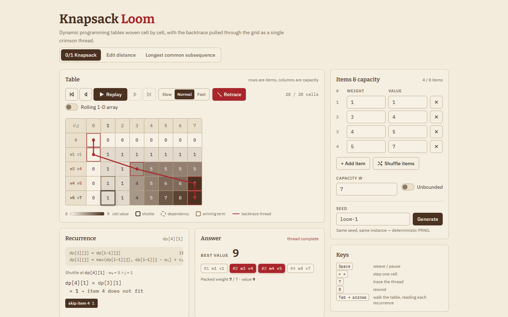

# Knapsack Loom

Dynamic programming tables woven cell by cell for 0/1 knapsack, edit distance, and LCS, with backtracking highlighted as a thread through the grid.



## Features

- **Three DP problems from scratch** — 0/1 knapsack (with an *unbounded* toggle), Levenshtein edit distance, and longest common subsequence. No libraries; each is a generator over a pre-allocated table.
- **Editable inputs** — an item weight/value table with add/remove and a capacity field; two strings for the string problems. Everything is clamped to sizes that stay legible.
- **Step animation with a shuttle cursor** — the current cell is outlined, every cell it reads is outlined dashed, and the winning dependency is outlined solid. Play, pause, step in either direction, or jump to the end at three speeds.
- **Backtrace mode** — press *Trace* and a single crimson thread grows from the corner cell back to the origin, lighting up the chosen items, the alignment, or the subsequence as it passes.
- **Space-optimised view** — toggle the rolling 1-D array for knapsack to watch which entry is overwritten at each step, and why 0/1 walks *j* downward while unbounded walks it upward.
- **Recurrence panel** — the general formula plus the recurrence for the hovered (or current) cell with its real substituted numbers and every candidate term.
- **Seeded generator and shuffle** — deterministic random instances from a text seed, and a *Shuffle items* button that reorders the rows while the best value stays put.
- Keyboard throughout: `Space` weave/pause, `←`/`→` step, `T` trace, `R` rewind, and `Tab` into the grid to walk cells with the arrow keys. Shareable `?p=edit` / `?p=lcs` / `?rolling=1` URLs.

## How it works

Every problem is written as a **generator that yields fill events** over a table whose base cases are filled up front. Each event records the cell `(i, j)`, its value, the cells it read, and the candidate *terms* that competed for it — for knapsack, "skip item *i*" reading `dp[i−1][j]` and "take item *i*" reading `dp[i−1][j − wᵢ] + vᵢ`. The recurrence panel is rendered from those same terms, so the explanation and the number in the cell can never disagree; the vitest suite pins the text down to the character:

```
dp[2][7] = max(dp[1][7], dp[1][7 − 3] + 4) = max(1, 1 + 4) = 5
```

The UI never copies tables per step. It drains the generator once, records the **fill order** of every cell, and derives the visible table from a single step index: a cell is shown when its order is at most the current step. That makes stepping backward, scrubbing, and speed changes free, and it is why the rolling 1-D array can be derived rather than simulated — entries already visited in the current pass show row *i*, the rest still show row *i − 1*. For 0/1 knapsack the generator visits *j* from the capacity downward, exactly as the one-row algorithm must so that `dp[j − w]` still holds the previous row; for unbounded it climbs so that `dp[j − w]` already holds the current row.

**Backtracking is a separate pure function** over the finished table. Starting from the corner it asks, at each cell, which term must have won: for knapsack, `dp[i][j] === dp[i−1][j]` means the item was skipped (move up), otherwise it was taken (jump to `dp[i−1][j − wᵢ]`); for edit distance it checks match, substitute, delete, insert in that order; for LCS it follows the diagonal on a match and otherwise the larger neighbour. The hops are drawn as one SVG polyline whose dash offset shrinks each tick, so the thread appears to be pulled through the grid.

```
        j→  0  1  2  3  4  5  6  7
   ∅        0  0  0  0  0  0  0  0
   w1 v1    0  1  1  1  1  1  1  1
   w3 v4    0  1  1 [4] 5  5  5  5      take item 2  (j: 3 → 0), then up to the origin
   w4 v5    0  1  1  4  5  6  6 [9]     take item 3  (j: 7 → 3)
   w5 v7    0  1  1  4  5  7  8 [9]     skip item 4  — the thread starts in this corner
```

## Run it

```sh
npm install
npm run dev        # local dev server
npm run build      # type-check with tsc, then bundle with vite
npm test           # vitest: 26 assertions across the DP core, recurrence text, and PRNG
```

## Tech

React 19 · TypeScript (strict) · Vite 8 · Tailwind CSS 4 · Vitest 5 · Bitter, IBM Plex Sans and IBM Plex Mono via `@fontsource`.

## License

MIT © 2026 Jafn
